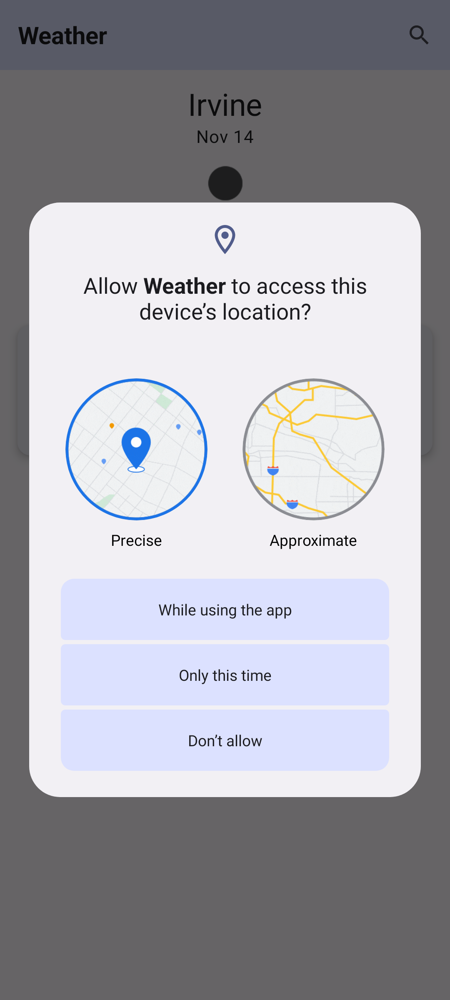
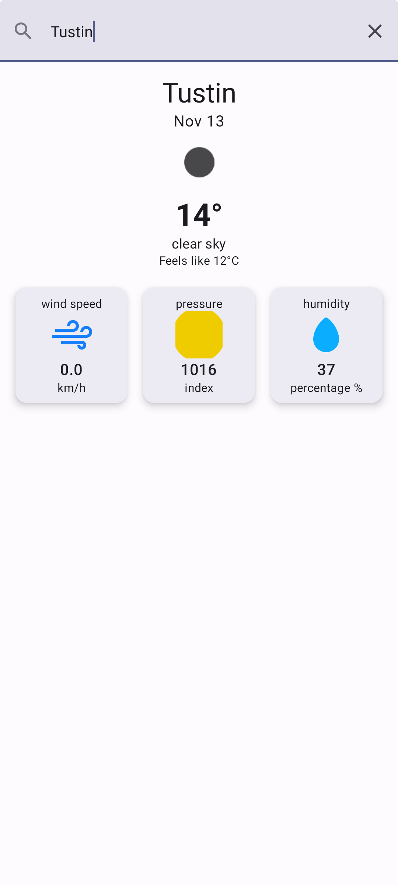
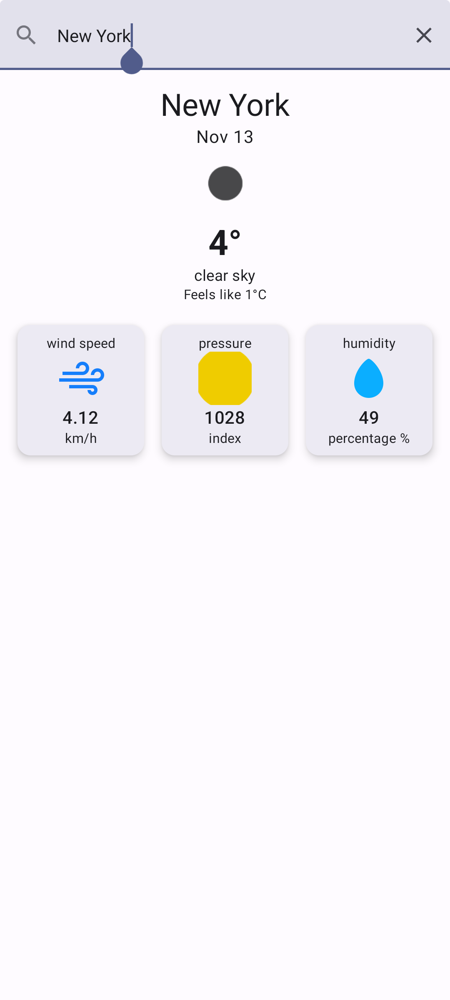
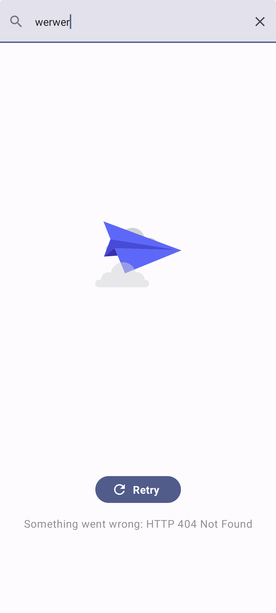

## Project Overview

The **Weather App** will allow users to:
1. Search weather data by entering a US city.
2. Display weather details fetched from the [OpenWeatherMap API](https://openweathermap.org/api).
3. Provide location-based weather updates if location permission is granted.
4. Auto-load the last searched city's weather on launch.

## Requirements

### Must-Have Features

1. **Search Screen**
   - A simple UI where users can enter a US city name to retrieve and display weather details.
   - Fetch data from the OpenWeatherMap API using **Retrofit**.
   - Display essential weather info and an icon that represents current conditions.
   - Cache images if needed for offline usage or faster loading.

2. **Location Access**
   - Prompt the user for location access upon app launch.
   - If access is granted, display weather data based on the user’s location.
   - Ensure permissions are correctly handled, especially for Android versions with stricter requirements.

3. **Load Last Searched City**
   - Persist the last searched city and auto-load its weather data when the app is relaunched.

4. **Code Quality**
   - Follow the **MVVM** architecture pattern.
   - Write **well-commented, readable code** with a focus on separation of concerns and defensive programming.
   - Unit tests with **JUnit** to ensure core functionalities work as expected.

### Less-Important Features (UI & Technologies)

- Basic UI is sufficient, but can optionally use **Jetpack Compose** for a more modern approach.
- **Dagger 2**, **Hilt**, or **Koin** for dependency injection, which is optional but encouraged.
- **RxJava** or **Kotlin Coroutines** to handle asynchronous network calls.
- **Jetpack Navigation** for improved navigation and ease of backstack management.
- Use **Mockito** or **Espresso** for UI or integration tests if time permits.

---

## 📱 Screenshots
</a>
</a>
</a>
</a>
</a>

## Project Structure

### 1. **Model-View-ViewModel (MVVM)**

   - **Model**: Represents data and handles API calls.
   - **ViewModel**: Manages UI-related data in a lifecycle-conscious way.
   - **View**: Activity or Fragment that observes data from ViewModel and displays it.

### 2. **Network Layer**

   - **Retrofit**: To handle API calls to OpenWeatherMap.
   - **Kotlin Coroutines**: For asynchronous calls, although RxJava can be used if preferred.
   - **Caching**: Use image caching with Glide or Coil for weather icons.

### 3. **Permissions**

   - Handle location permission requests properly, especially for Android 11+.
   - Provide fallbacks in case permissions are denied.

### 4. **Persistence**

   - Store the last searched city in shared preferences or a local database.
   - Retrieve and display this data upon app startup if no new location data is available.

---

## Suggested Libraries

1. **Network**: Retrofit for API calls
2. **Concurrency**: Coroutines (Kotlin) or RxJava (optional)
3. **Dependency Injection**: Hilt (preferred), Dagger 2, or Koin
4. **Image Loading**: Glide or Coil
5. **Testing**: JUnit, Mockito (optional), Espresso (optional)

---

## Implementation Outline

1. **Initialize the App and Setup Permissions**
   - On launch, check for location permissions.
   - If granted, get the location and call OpenWeatherMap API for current location weather.
   - If not, display the last searched city weather or prompt the user to search for a city.

2. **Weather Search Screen**
   - Input field for users to enter a city name.
   - Display weather details after calling the OpenWeatherMap API.
   - Show a weather icon with caching for efficiency.

3. **ViewModel and LiveData**
   - Use `LiveData` to observe data changes and update UI accordingly.
   - Handle data loading, success, and error states gracefully.

4. **Data Caching and Offline Support**
   - Cache images with Glide or Coil.
   - Persist the last searched city data using SharedPreferences.

5. **Testing**
   - Unit tests with JUnit for ViewModel and API calls.
   - (Optional) UI tests with Espresso or Mockito.

---

## Sample Code Snippets

### 1. Fetching Data with Retrofit

```kotlin
interface WeatherApiService {
    @GET("weather")
    suspend fun getWeatherByCity(
        @Query("q") city: String,
        @Query("appid") apiKey: String
    ): WeatherResponse
}
```

### 2. ViewModel with Coroutines

```kotlin
class WeatherViewModel(private val repository: WeatherRepository) : ViewModel() {
    private val _weatherData = MutableLiveData<WeatherData>()
    val weatherData: LiveData<WeatherData> get() = _weatherData

    fun fetchWeather(city: String) {
        viewModelScope.launch {
            try {
                val result = repository.getWeather(city)
                _weatherData.value = result
            } catch (e: Exception) {
                // Handle error
            }
        }
    }
}
```

### 3. Caching Images with Coil

```kotlin
Image(
    painter = rememberImagePainter(
        data = weatherIconUrl,
        builder = {
            crossfade(true)
            placeholder(R.drawable.placeholder)
        }
    ),
    contentDescription = "Weather Icon"
)
```